# resume-builder-skill

一个面向中文简历制作的 Codex Skill：帮你从开源中文简历模板中选出合适方案，拉取模板，迁移内容，编译输出，并检查最终版面。

你可以把它理解成 **中文简历模板索引 + Codex 自动简历生成助手**。模板效果来自 [dyweb/awesome-resume-for-chinese](https://github.com/dyweb/awesome-resume-for-chinese) 及其收录的开源项目，本仓库在此基础上增加了 Codex 可读的模板索引、选择规则和自动化脚本。

## 效果预览

先看能做出来什么效果。安装 skill 后，你可以让 Codex 根据岗位和经历从这些模板中推荐合适的样式，再自动迁移你的简历内容。

### LaTeX 简历

- [dyweb/Deedy-Resume-for-Chinese](https://github.com/dyweb/Deedy-Resume-for-Chinese) 适合应届毕业生的 LaTeX 简历模板。

<div align="center">
  <a href="https://github.com/dyweb/Deedy-Resume-for-Chinese">
    
  </a>
</div>

- [geekplux/cv_resume](https://github.com/geekplux/cv_resume) 中文简历 LaTeX 模板，基于 ModernCV 优化中文字体支持。

<div align="center">
  <a href="https://github.com/geekplux/cv_resume">
    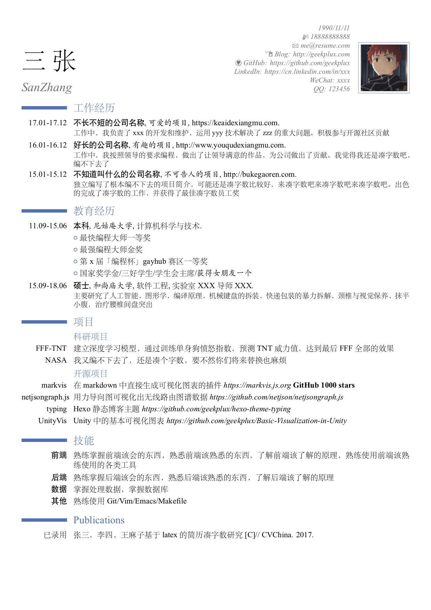
  </a>
</div>

- [billryan/resume](https://github.com/billryan/resume) 优雅的 LaTeX 简历模板，适合技术岗和学术风格简历。

<div align="center">
  <a href="https://github.com/billryan/resume">
    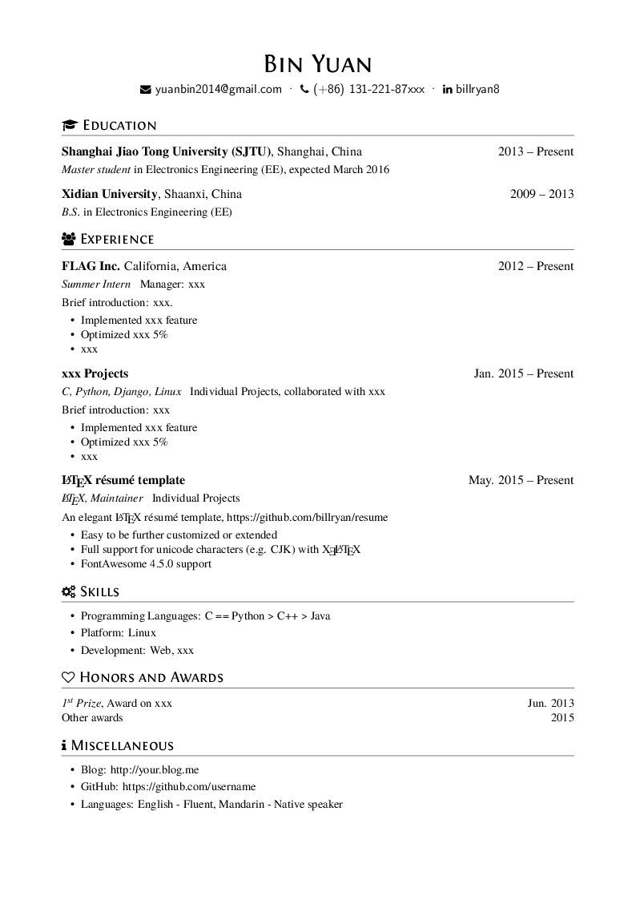
  </a>
</div>

- [hijiangtao/resume](https://github.com/hijiangtao/resume) 改良自 billryan/resume 的中文 LaTeX 简历模板。

<div align="center">
  <a href="https://github.com/hijiangtao/resume">
    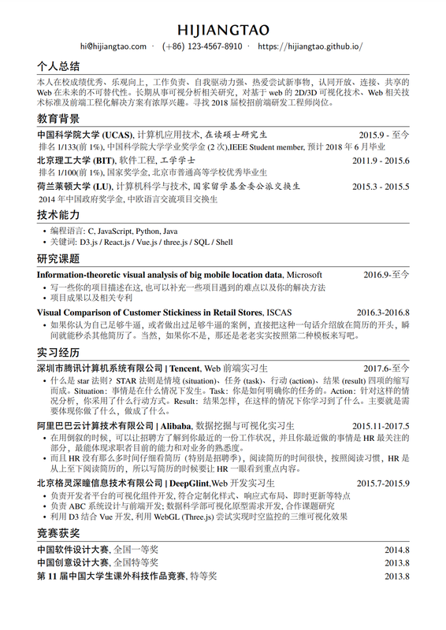
  </a>
</div>

- [fky2015/resume-ng](https://github.com/fky2015/resume-ng) 注重信息密度和美观度的 LaTeX 简历排版模板。

<div align="center">
  <a href="https://github.com/fky2015/resume-ng">
    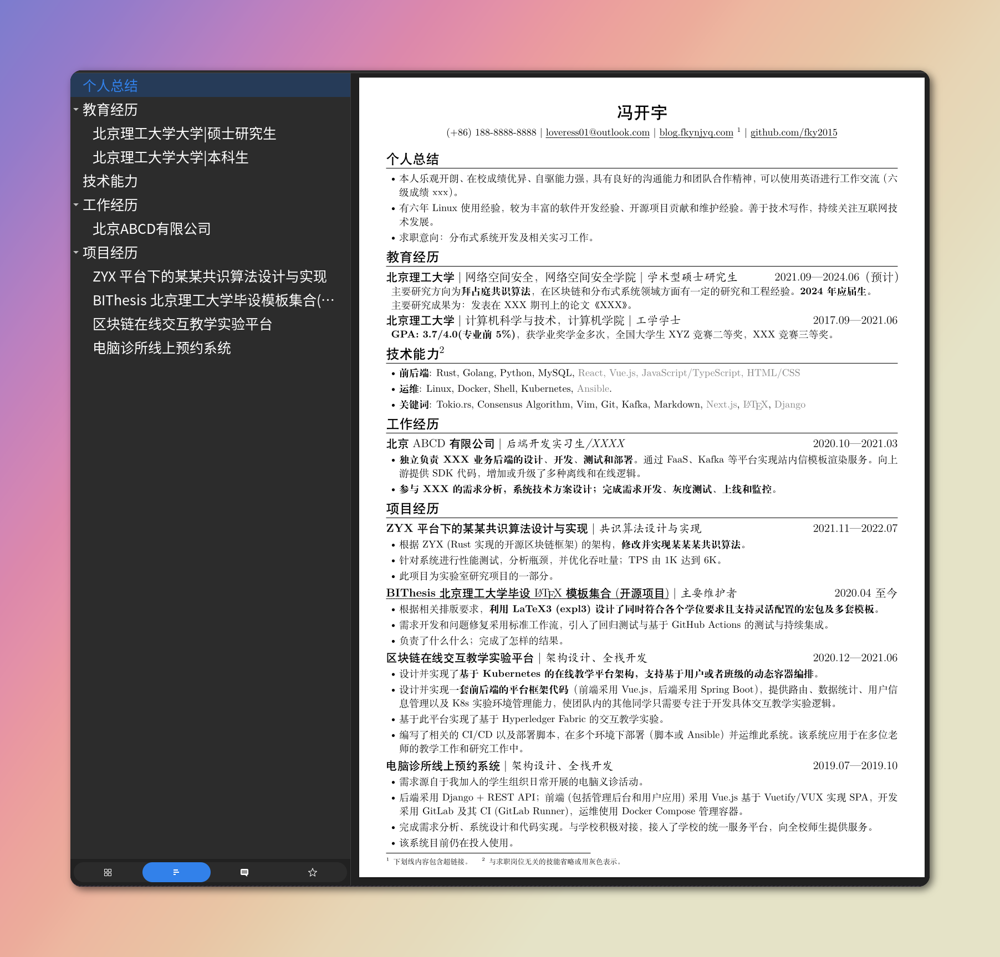
  </a>
</div>

- [luooofan/resume](https://github.com/luooofan/resume) 改良自 billryan/resume 的中文 LaTeX 简历模板。

<div align="center">
  <a href="https://github.com/luooofan/resume">
    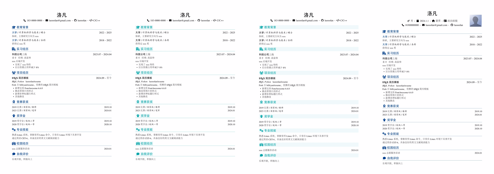
  </a>
</div>

### Markdown / HTML / Typst 简历

- [NewFuture/CV](https://github.com/NewFuture/CV) Markdown 在线简历生成模板。

<div align="center">
  <a href="https://github.com/NewFuture/CV">
    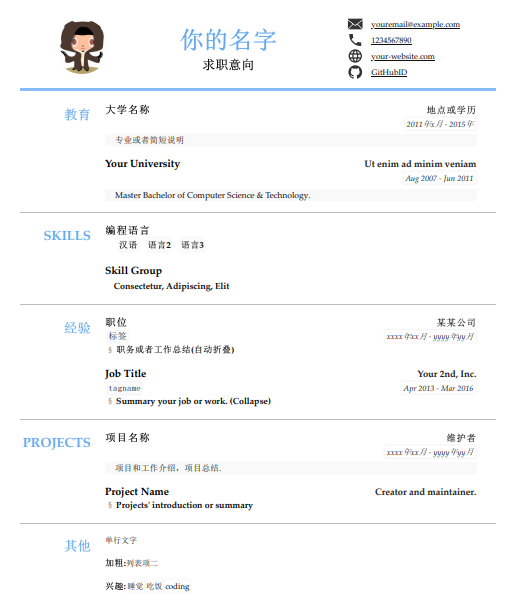
  </a>
</div>

- [CyC2018/Markdown-Resume](https://github.com/CyC2018/Markdown-Resume) Markdown 简历模板。

<div align="center">
  <a href="https://github.com/CyC2018/Markdown-Resume">
    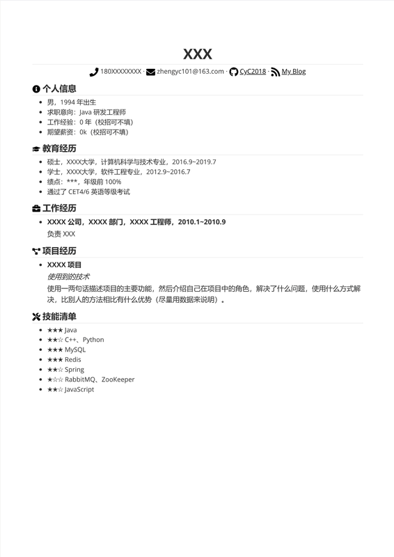
  </a>
</div>

- [OrangeX4/Chinese-Resume-in-Typst](https://github.com/OrangeX4/Chinese-Resume-in-Typst) 使用 Typst 编写的中文简历模板。

<div align="center">
  <a href="https://github.com/OrangeX4/Chinese-Resume-in-Typst">
    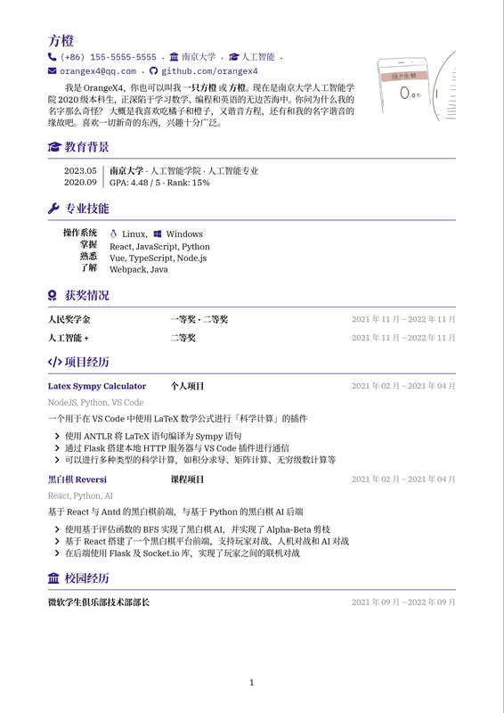
  </a>
</div>

- [xiao555/resume-it](https://github.com/xiao555/resume-it) Web 前端工程师求职模板。

<div align="center">
  <a href="https://github.com/xiao555/resume-it">
    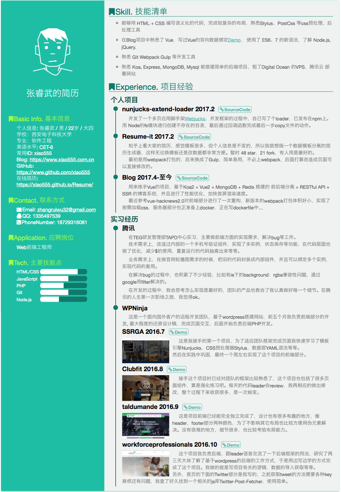
  </a>
</div>

- [JSON Resume](https://jsonresume.org/) 开源结构化简历标准，适合一份数据生成多套主题。

<div align="center">
  <a href="https://jsonresume.org/">
    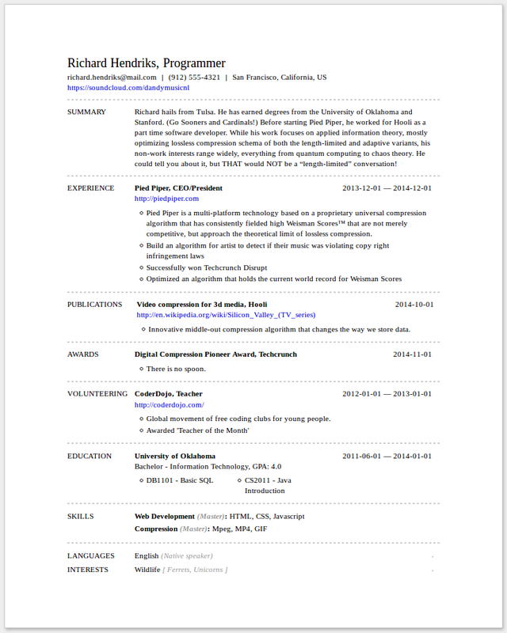
  </a>
</div>

- [salomonelli/best-resume-ever](https://github.com/salomonelli/best-resume-ever) 多行业简历模板选择器。

<div align="center">
  <a href="https://github.com/salomonelli/best-resume-ever">
    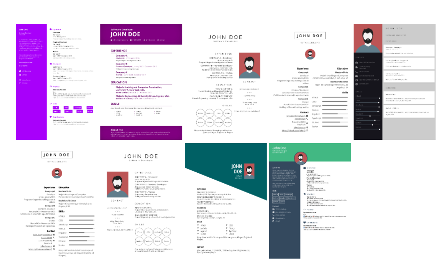
  </a>
</div>

## 这个 skill 能做什么

- 根据岗位、学历、项目经历和目标风格推荐模板。
- 支持 LaTeX、Typst、Markdown、HTML/JS、Jekyll、JSON Resume 等常见简历形式。
- 根据你的原始简历内容迁移到目标模板。
- 帮你处理中文字体、页数、链接、版面溢出和隐私信息检查。
- 按需拉取模板仓库，不把所有模板源码塞进本仓库。
- 提供脚本辅助检查模板 URL、拉取模板、识别编译命令。

## 三步使用

### 1. 安装 skill

```bash
git clone https://github.com/Altman-conquer/resume-builder-skill.git
mkdir -p "${CODEX_HOME:-$HOME/.codex}/skills"
cp -r resume-builder-skill/skills/chinese-resume-builder "${CODEX_HOME:-$HOME/.codex}/skills/"
```

安装完成后重启 Codex。

### 2. 直接向 Codex 提需求

```text
使用 $chinese-resume-builder 帮我选择一个适合应届算法工程师的 LaTeX 中文简历模板。
```

```text
使用 $chinese-resume-builder 把我现在的 Markdown 简历改成一页纸中文 LaTeX 简历。
```

```text
使用 $chinese-resume-builder 根据我的项目经历生成一份适合后端开发岗位投递的中文简历。
```

### 3. 得到可继续编辑的简历项目

Codex 会完成模板选择、模板拉取、内容迁移、编译命令识别和最终检查。你拿到的不是一段静态文本，而是可以继续编辑、编译和维护的简历项目。

## 安装

如果你只想安装 skill，可以直接执行：

```bash
git clone https://github.com/Altman-conquer/resume-builder-skill.git
mkdir -p "${CODEX_HOME:-$HOME/.codex}/skills"
cp -r resume-builder-skill/skills/chinese-resume-builder "${CODEX_HOME:-$HOME/.codex}/skills/"
```

然后重启 Codex。

## 典型使用场景

### 选择模板

```text
使用 $chinese-resume-builder，帮我从模板库里选 3 个适合 AI 算法实习投递的中文简历模板，并说明区别。
```

### 迁移已有简历

```text
使用 $chinese-resume-builder，把当前仓库里的 resume-zh_CN.tex 改造成信息密度更高的一页纸中文简历。
```

### 生成新简历

```text
使用 $chinese-resume-builder，根据我的教育背景、实习经历、项目经历和论文经历生成一份中文简历。
```

### 检查简历

```text
使用 $chinese-resume-builder，检查我的中文简历是否有内容冗余、表述不清、链接失效或版面溢出。
```

## 仓库结构

```text
resume-builder-skill/
├── README.md
├── LICENSE
├── contributing.md
├── tests/
│   └── test_skill_package.py
└── skills/
    └── chinese-resume-builder/
        ├── SKILL.md
        ├── agents/
        │   └── openai.yaml
        ├── references/
        │   ├── license-checklist.md
        │   ├── resume-writing-guide.md
        │   ├── selection-guide.md
        │   └── templates.json
        └── scripts/
            ├── compile_resume.py
            ├── fetch_template.py
            └── inspect_template_repo.py
```

## 工具脚本

检查模板仓库 URL：

```bash
python3 skills/chinese-resume-builder/scripts/inspect_template_repo.py \
  --url https://github.com/dyweb/Deedy-Resume-for-Chinese
```

预览安全拉取命令：

```bash
python3 skills/chinese-resume-builder/scripts/fetch_template.py \
  --dry-run \
  --repo https://github.com/dyweb/Deedy-Resume-for-Chinese \
  --dest ./work/deedy-resume
```

检测简历项目构建命令：

```bash
python3 skills/chinese-resume-builder/scripts/compile_resume.py --dry-run ./work/deedy-resume
```

## 开发

运行测试：

```bash
python3 -m unittest discover -s tests
```

校验 skill 结构：

```bash
python3 "${CODEX_HOME:-$HOME/.codex}/skills/.system/skill-creator/scripts/quick_validate.py" \
  skills/chinese-resume-builder
```

## 贡献

欢迎继续补充模板索引、效果图、适用场景和脚本能力。

新增模板时，请补充模板名称、上游链接、模板类型、适用人群、构建工具和 license 信息。

## License

本仓库中的 skill 代码、脚本和原创文档使用 MIT License。

第三方模板、字体、截图和示例内容仍归各自上游项目所有，并遵循对应项目的 license。

---

## English

`resume-builder-skill` provides a Codex skill named `chinese-resume-builder` for building Chinese resumes from curated open-source templates.

It shows template previews first, then helps Codex recommend a template, fetch it, migrate resume content, detect build commands, and review the final output.

Install:

```bash
git clone https://github.com/Altman-conquer/resume-builder-skill.git
mkdir -p "${CODEX_HOME:-$HOME/.codex}/skills"
cp -r resume-builder-skill/skills/chinese-resume-builder "${CODEX_HOME:-$HOME/.codex}/skills/"
```

Example:

```text
Use $chinese-resume-builder to choose a LaTeX Chinese resume template and migrate my existing resume into it.
```
